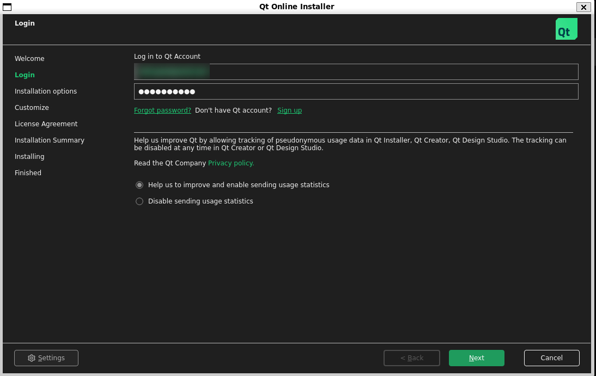
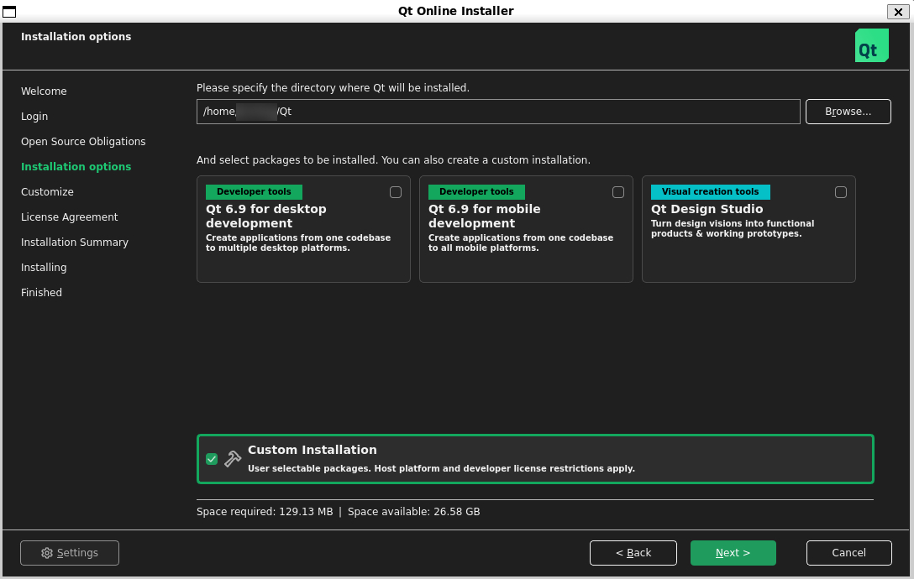

# Android Build Guide

This guide describes how to build and package the `bitcoin-qt` GUI for Android on Linux and WSL (macOS has yet to be tested).


## Dependencies

Before proceeding with an Android build one needs to get the [Android SDK](https://developer.android.com/studio) and use the "SDK Manager" tool to download the NDK and one or more "Platform packages" (these are Android versions and have a corresponding API level).

Download Qt 6.7.3 using
```bash
# grab the installer (≈70 MB)
wget https://download.qt.io/official_releases/online_installers/qt-online-installer-linux-x64-online.run \
     -O qt-online-installer-linux-x64-online.run
```

Extract it to a directory of your choice.

```bash
chmod +x qt-online-installer-linux-x64-online.run
./qt-online-installer-linux-x64-online.run
```

<details>
  <summary>Ubuntu screenshots:</summary>

  

  

  

  

  install only:

      ☑ Android

      ☑ Shader Tools

      ☑ Sources
  

  

  

</details>

Once Qt 6.7.3 is installed, click finish.

Qt 6.7.3 used in depends supports Android NDK version is [r26b (26.1.10909125)](https://github.com/android/ndk/wiki/Changelog-r26).

In order to build `ANDROID_API_LEVEL` (API level corresponding to the Android version targeted, e.g. Android 9.0 Pie is 28 and its "Platform package" needs to be available) needs to be set.

Qt 6.7.3 used in depends supports API levels from 26 to 34.

When building [depends](../depends/README.md), additional variables `QT_ANDROID_SDK` `QT_HOST_QT` `ANDROID_SDK` and `ANDROID_NDK` need to be set.

This is an example command for an emulator build with disabled dependencies:

```bash
gmake -C depends \
  HOST=x86_64-linux-android \
  QT_ANDROID_SDK=path/to/Qt/6.7.3/android_x86_64 \
  QT_HOST_QT=path/to/Qt/6.7.3/gcc_64 \
  ANDROID_SDK=path/to/Android/Sdk \
  ANDROID_NDK=path/to/Android/Sdk/ndk/26.1.10909125 \
  ANDROID_API_LEVEL=33 \
  -j$(nproc)
```

### Parameters explained

* `HOST` – target triple for the desired Android ABI. Supported values include
  * `aarch64-linux-android` → ABI `arm64-v8a` (64-bit ARM)
  * `armv7a-linux-android` → ABI `armeabi-v7a` (32-bit ARM)
  * `x86_64-linux-android` → ABI `x86_64`
* `QT_ANDROID_SDK` – path to the Qt for Android kit for the target ABI (provided by the Qt Online Installer).
* `QT_HOST_QT` – path to the host Qt kit (usually the `gcc_64` or `desktop` kit).
* `ANDROID_SDK` – root of the Android SDK.
* `ANDROID_NDK` – path to the Android NDK version that matches the Qt kit (r26b at the time of writing).
* `ANDROID_API_LEVEL` – Android API / platform level to target. Must be between 26 and 34 for Qt 6.7.3.

#### Building for other ABIs

The build system fully supports the other ABIs mentioned above.
For example, to produce a 32-bit ARM (“armeabi-v7a”) build:

```bash
gmake -C depends \
  HOST=armv7a-linux-android \
  QT_ANDROID_SDK=/path/to/Qt/6.7.3/android_armv7 \
  QT_HOST_QT=/path/to/Qt/6.7.3/gcc_64 \
  ANDROID_SDK=/path/to/Android/Sdk \
  ANDROID_NDK=/path/to/Android/Sdk/ndk/26.1.10909125 \
  ANDROID_API_LEVEL=34 \
  -j$(nproc)
```

After the `depends` step, simply replace the host triplet (i.e. `x86_64-linux-android`) with the target triplet (i.e. `armv7a-linux-android` or `aarch64-linux-android`) in the CMake command-lines shown in the next section.


## Building and packaging

After the depends are built configure, build and create an Android Application Package (APK) as follows (based on the example above):

First we need to export some environment variables:

```bash
export QT_ANDROID_SDK=/path/to/Qt/6.7.3/android_x86_64
export QT_HOST_QT=/path/to/Qt/6.7.3/gcc_64
export ANDROID_NDK=/path/to/Android/Sdk/ndk/26.1.10909125
export ANDROID_SDK=/path/to/Android/Sdk
export CMAKE_TOOLCHAIN_FILE=$QT_ANDROID_SDK/lib/cmake/Qt6/qt.toolchain.cmake
export DEPENDS=$PWD/depends/armv7a-linux-android
export PKG_CONFIG_PATH=$DEPENDS/lib/pkgconfig
export PKG_CONFIG_LIBDIR=$DEPENDS/lib/pkgconfig
```
Then we need to create a build directory and run CMake (TODO: this can be streamlined using cmake):

```bash
cmake -S . -B build -G Ninja \
      -DCMAKE_PREFIX_PATH=$QT_ANDROID_SDK \
      -DCMAKE_TOOLCHAIN_FILE=$QT_ANDROID_SDK/lib/cmake/Qt6/qt.toolchain.cmake \
      -DQT_HOST_PATH=$QT_HOST_QT \
      -DANDROID_ABI=x86_64 \
      -DANDROID_PLATFORM=android-33 \
      -DCMAKE_PREFIX_PATH=$DEPENDS\;$CMAKE_PREFIX_PATH \
      -DCMAKE_FIND_ROOT_PATH=$DEPENDS\;$CMAKE_FIND_ROOT_PATH \
      -DQRencode_INCLUDE_DIR=$DEPENDS/include \
      -DQRencode_LIBRARY=$DEPENDS/lib/libqrencode.a \
      -DBUILD_GUI=ON \
      -DBUILD_CLI=OFF \
      -DBUILD_DAEMON=OFF \
      -DBUILD_TX=OFF \
      -DBUILD_UTIL=OFF \
      -DBUILD_TESTS=OFF \
      -DBUILD_BENCH=OFF \
      -DWITH_DBUS=OFF \
      -DCMAKE_BUILD_TYPE=RelWithDebInfo \
      -DSQLite3_INCLUDE_DIR=$DEPENDS/include \
      -DSQLite3_LIBRARY=$DEPENDS/lib/libsqlite3.a
```


```bash
cmake --build build --target apk_package -j$(nproc) # Use "-j N" for N parallel jobs.
```

The APKs will be available in the following directory:
```bash
$ tree build/android_package/build/outputs/apk/debug
build/android_package/build/outputs/apk/debug
├── android_package-debug.apk
└── output-metadata.json

0 directories, 2 files
```
 then verify the size of the apk it should be around ~20MB.

 ```bash
$ du -h build/android_package/build/outputs/apk/debug/android_package-debug.apk
24M     build/android_package/build/outputs/apk/debug/android_package-debug.apk
 ```
<details>
  <summary>Android emulator screenshots:</summary>

  

  

  

 

</details>

## PS: Known issues:
* Wallet creation is having issues with text input (in the emulator presing enter after text input worked),
* Force dark mode for quality of life (doesn't need to be final)


